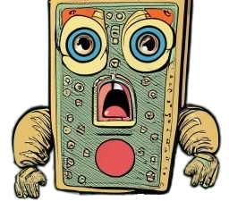
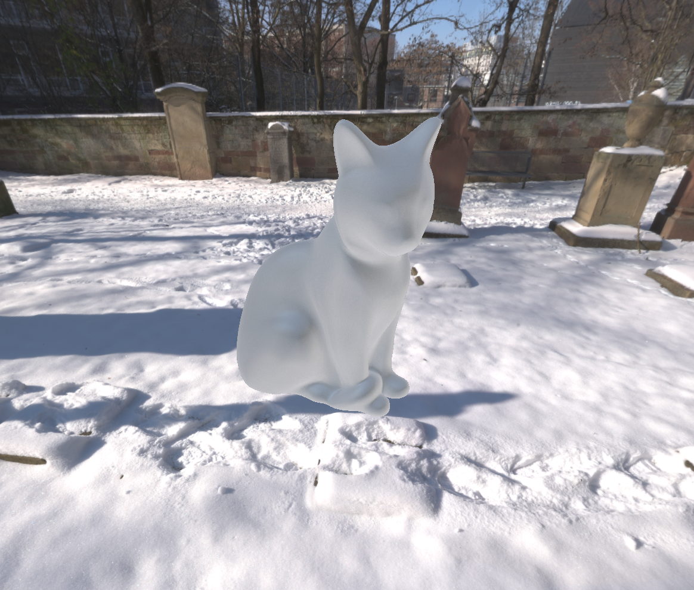
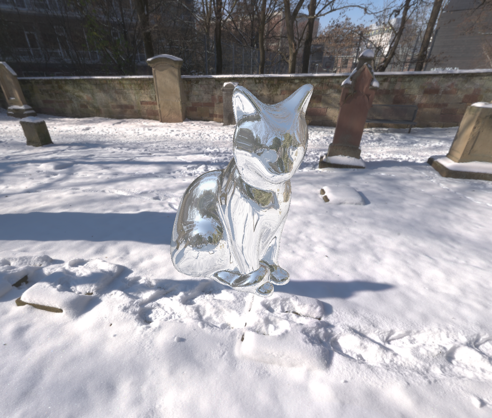
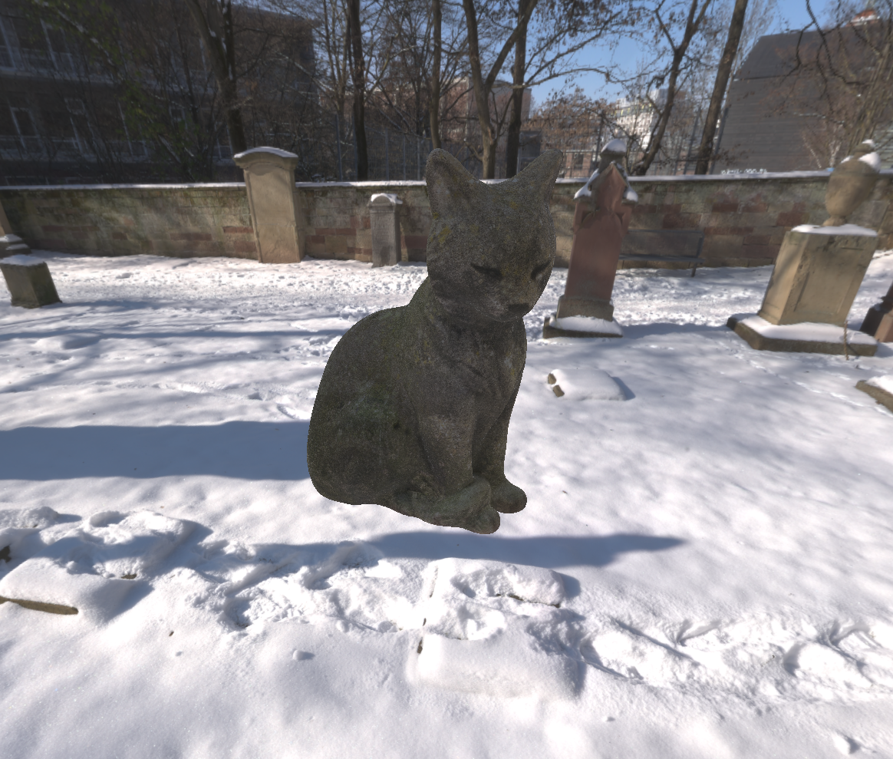
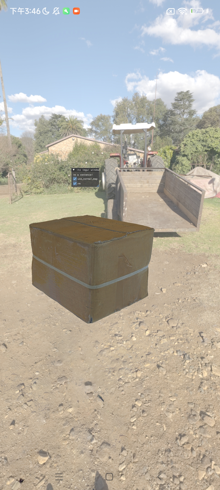
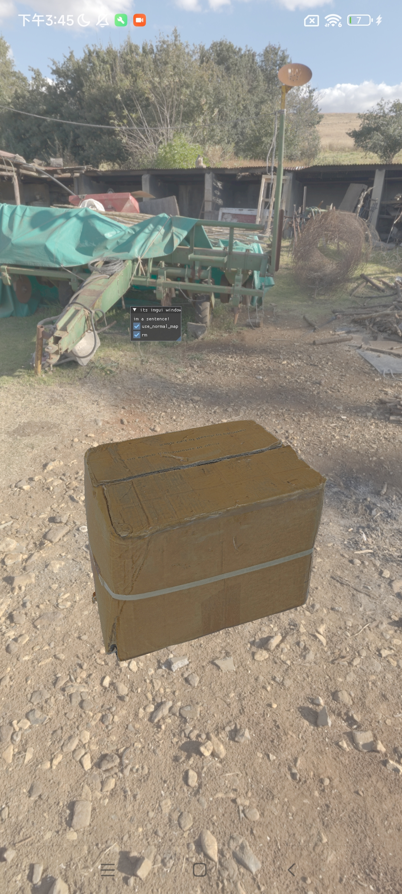
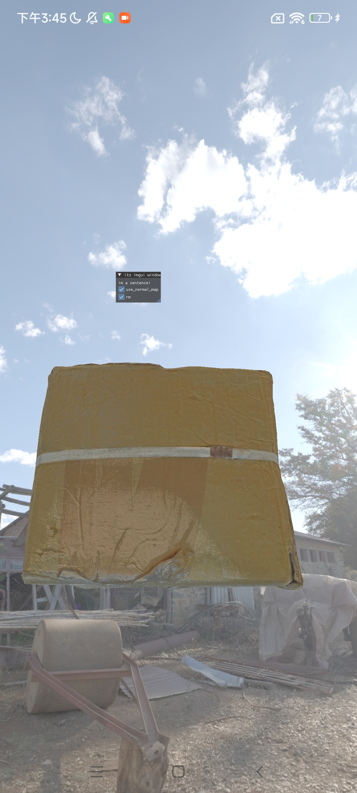
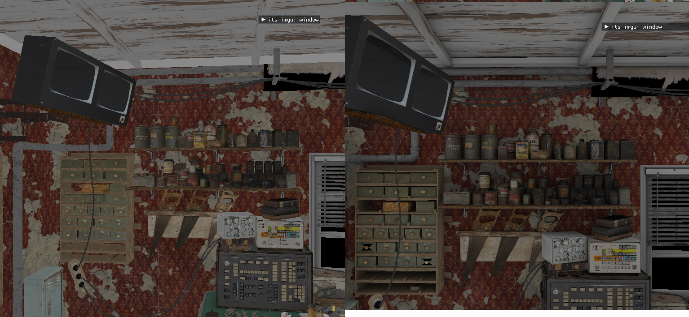

<!-- <div align="center">
 -->

# 🤷🏼‍♂️A RenderingEngine powered by Vulkan🤷🏼‍♂️

[](https://github.com/MouseChannel/MCRT/actions/workflows/windows.yaml?query=branch%3Amocheng)
[](https://github.com/MouseChannel/MCRT/actions/workflows/linux.yaml?query=branch%3Amocheng)
[](https://github.com/MouseChannel/MCRT/actions/workflows/android.yaml?query=branch%3Amocheng)

</div>

<!-- # 🔨Setup

has tested by MSVC,Clang,GCC

```
cmake  -GNinja 
ninja
``` -->

# 🌞Overview🌞

### 🫱 support platform

- ✅ **Windows** 💻
- ✅ **Linux** 💻
- ✅ **Android** 📱 (Not all features are supported)
- ❌ **Mac** 💻 todo 

### 🫱 work flows

- **RayTracing Pipeline**:  🙏 has not support in Mobile
- **Graphic pipeline**:  💪 support all platform

### 🫱 some showcase

<div align=center>
    
<br>
IBL-PBR raytracing
</div> 
<div align=center>
    
<br>
IBL-PBR workflow in RedMI📱 12
<br>
</div>

<div align=center >
    
<br> realtime Ambient Occlusion
<br>
<a href="./assets/showcase/cloudDemo.webm">
  
</a>
  
<br>
 Volumetric cloud 👈👈-----------------👉👉 Path tracing 
</div>

# 🔥 Detail / Feature🔥

### 🫱 Native SKYBOX

- render a native (2048*1024)HDRI to SKYBOX

### 🫱 PBR By IBL(Image Base Lighting) pre_rendering

- pre_calculate IBL_Gbuffer by `Compute_pipeline`
- pbr in Graphic Pipeline using IBL_Gbuffer,and also works on Android
- pbr in RayTracing Pipeline using IBL_Gbuffer,with single bounce to make it real-time

### 🫱 Vulkan CUDA interOP

compute-heavy task can be handled by **Computer-Shader** or **CUDA**

- Vulkan-CUDA Memory share and Image_data share,sync by Semaphore

### 🫱 Model Format

- ✅ **GLTF** , support most gltf_material_feature,like `KHR_materials_emissive_strength`and
  normal_map,AO_Metallic_Roughness_map and so on
- ✅ **OBJ**
- ❌ **FBX** 💻 todo

### 🫱  Volumetric cloud rendering

raymarching cloud density from 3D perlin noise.

Use vulkan raytracing pipeline to raymarching,
so [A supported GPU and Driver](https://www.khronos.org/blog/ray-tracing-in-vulkan#blog_Call_to_Action) is necessary.

- 🌟 pre_compute 3D(256x256x256) Perlin-Noise by compute shader, and sampling by boundary mirror uv to make it continuous
- 🌟 raymarching in **rmiss** shader-stage, use `ray-max-range` in `traceRayEXT` to simulate one step in raymarching

### 🫱 Off-line Rendering

support offline rendering using Path Tracing by vulkan raytracing pipeline

also [A supported GPU and Driver](https://www.khronos.org/blog/ray-tracing-in-vulkan#blog_Call_to_Action) is needed,
like **NVIDIA RTX 20-Series** or higher version, and **AMD Radeon RX 6600 XT** or higher version

- 🌟 Importance Sampling Path Tracing
- 🌟 Disney style BRDF shading in Path Tracing
- 🌟 Noise reduction using joint bilateral filtering by `compute pipeline`

# ⛱️ other basics in Rendering engine ⛱️

- 👏 imgui
- 👏 skybox
- 👏 TAA (Temporal Anti-Aliasing)
- 👏 hdr tone mapping
- 👏 real-time AO calculate (by rayquery extension)
- 👏 AO map
- 👏 texture mipmap
- 👏 Metallic_Roughness PBR material work flow
- so on

# ♿ TODO

- 🔖 NERF Work flow
- 🔖 SDF
- 🔖 NVidia Restir sampling Path tracing
