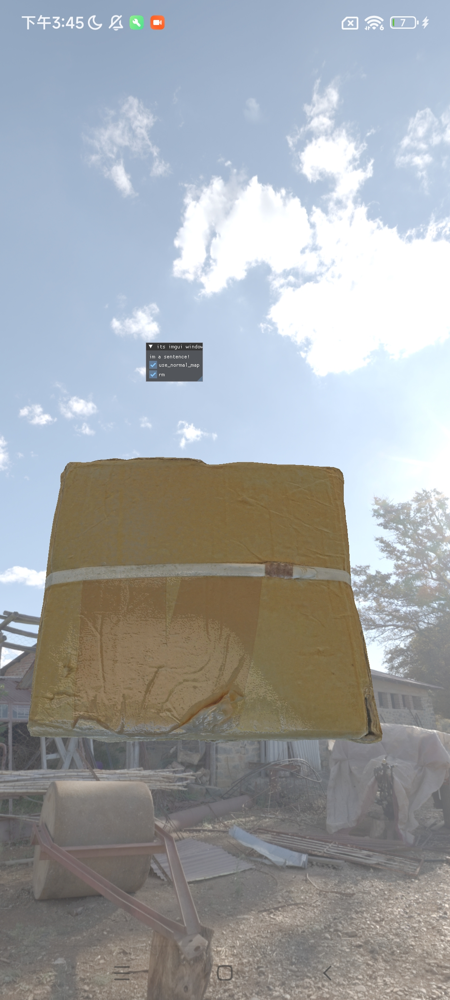

## 将Graphic pipeline移植到Android上
#### 手机环境说明
由于我用的是**红米**，Android12，API31，arm64-v8 cpu架构，Vulkan的API版本基本只能支持到1.1版本，且大部分GPU extension都不支持，因此使用宏额外隔离开

现在android只能打Debug包，因为release有很多vulkan参数还没有适配，以后会补上

现在apk文件较大的原因是内置了Vulkan_validation动态库，还有一些没用到的模型和贴图之类的，以后会删掉

使用音量键移动，屏幕滑动修改视角
#### screenshot
