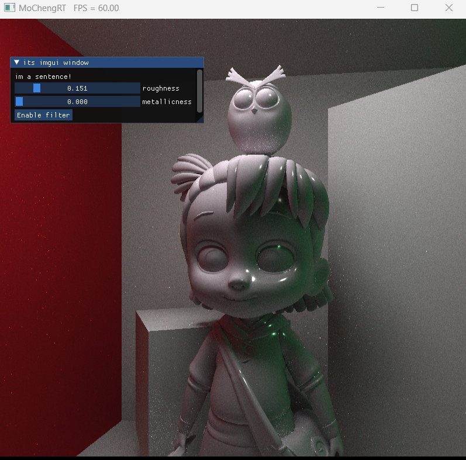

```

cook_torrance


radiance = diffuse + specular

//lambert
diffuse = color/Pi

specular = (D*G*F)/ (4* dot(normal,view_dir)*dot(normal, light_dir))

specially: 
 in path_tracing :view_dir = the radiance come in
 in raster: view_dir = camera_dir

```


