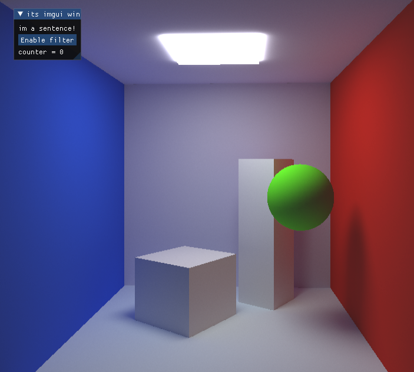

```
    simple path tracing
    shade(p)
        if ray hit the light
            return light_emit * BRDF * cosine / pdf
        else if ray hit an object at q
            return shade(q) * BRDF * cosine / pdf
  
```




